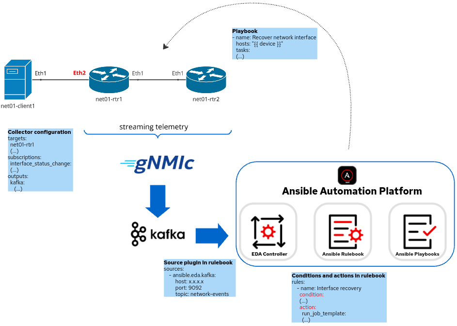

# Ansible and Event-Driven Automation for networks
This project demonstrates an example of how can we use Ansible and Event-Driven Automation for network management and operations. By leveraging Event-Driven approach we can implement event-based automation and automatically react to network events in real-time. 

# Demo environment
Below we can see the environment used in this demo:




The topology consists of the following components
- network infrastructure (two Arista routers and one linux server)
- gNMIc collector
- Kafka server
- Ansible Automation Platform with EDA Controller

# Workflow
In this demo we are observing automatic reaction to the following network events:
1. Operational state change of port Ethernet2 in router net01-rtr1
2. Any configuration change to network commands in 'router bgp' context in router net01-rtr1

When network event occurs in the network infrastructure it is automatically streamed from network device to gNMIc collector which in turn sends this event to Kafka topic 'network-event' defined on Kafka server.  
Configuration of gNMIc collector:
```
targets:
  net01-rtr1
  (...)
subscriptions:
  interface_status_change:
  (...)
  bgp_network_prefix_configuration_change:
  (...)
outputs:
  kafka:
    topic: network-events
    (...)
```

Ansible Event-driven controler is listening to this Kafka topic using the __source plugin__ and reacts in real-time to the events based on __conditions__ and __actions__ defined in Ansible rulebook 'network-recovery.yml'.  
There are two important sections in this rulebook:
1. Sources  
EDA subscribes to Kafka topic 'network-events' using source plugin 'ansible.eda.kafka':
```
  sources:
    - ansible.eda.kafka:
        host: 192.168.122.110
        port: 9092
        topic: network-events
```

2. Rules  
EDA invokes actions based on conditions related to the event:
```
  rules:
    - name: Interface recovery
      condition: 
      (...)
      action:
        run_job_template:
  (...)
```

The action in this case is to run Ansible playbooks defined by Job Template in Ansible Controller based on type of the event:
1. Event 'interface_status_change'  
For this event Ansible Controller runs 'interface_recovery.yml' playbook to 'bounce' the affected port
2. Event 'bgp_network_prefix_configuration_change'  
In case of this event device configuration will be automatically reverted to the configuration defined in Source of True (SoT). The important aspect of network infrastructure in this project is that SoT for its network configuration (i.e. the desired state of configuration) is defined in Github. So to recover network from configuration drift we should apply configuration data from Github to the affected network device. To do this Ansible Controller runs 'configure_infrastructure.yml' playbook. To avoid reacting to each individual 'network' command change "throttle' section is defined in the rulebook to wait a defined period of time before trigerring action:
```
  throttle:
    once_after: 20 seconds
```
It is worth to note that for event 'bgp_network_prefix_configuration_change' action which runs playbook 'configure_infrastructure.yml' will be trigerred twice: the first time as a reaction to change in network and the second time as a reaction to event being result of corrective action itself. The third time is not trigerred because the second run will not introduce any changes so event will not be streamed to Kafka topic.


## Feedback
Feedback is always welcome! If you have any comments, please reach me out

## Author

[@mzdyb](https://www.linkedin.com/in/michal-zdyb-9aa4046/)