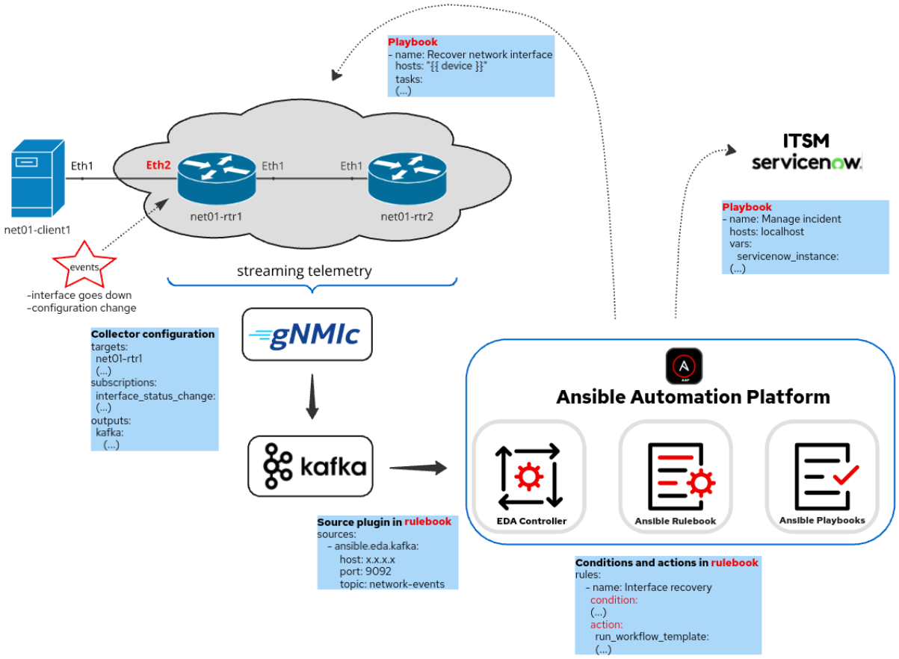

# Ansible and Event-Driven Automation for networks
This project demonstrates an example of how can we use Ansible and Event-Driven Automation for automatic network management and operations. By leveraging Event-Driven approach we can implement event-based automation and automatically react to network events in real-time. 

# Demo environment
Below we can see the environment used in this demo:




The topology consists of the following components
- network infrastructure (two Arista routers and one linux server)
- gNMIc collector
- Kafka server
- Ansible Automation Platform with EDA Controller
- ServiceNow instance

# Workflow
In this demo we are observing automatic reaction to the following network events:
1. Operational state change of port Ethernet2 in router net01-rtr1
2. Any configuration change to network commands in 'router bgp' context in router net01-rtr1

When network event occurs in the network infrastructure it is automatically streamed from network device to gNMIc collector which in turn sends this event to Kafka topic 'network-event' defined on Kafka server.  
On gNMIc collector we have to configure targets (router net01-rtr1 in our case), subscriptions (events which we want to receive from targets) and outputs (Kafka server in our case):
```
targets:
  net01-rtr1
  (...)
subscriptions:
  interface_status_change:
  (...)
  bgp_network_prefix_configuration_change:
  (...)
outputs: event-based automation
        topic: network-events
```

2. Rules  
EDA invokes actions based on conditions related to the event:
```
  rules:
    - name: Interface recovery
      condition: 
      (...)
      action:
        run_workflow_template:
  (...)
```
## Automation Workflows

It our rulebook the action is to run Ansible playbooks defined by Workflow Templates in Ansible Controller. The approach with Workflow Templates is called _**Push of the button automation**_ as it allows to create sophisticated automation logic and to run it by just clicking "Run" button in the Workflow. Here Workflows are automatically triggered by EDA controller. Based on type of the event two automation workflows are defined:  
1. Event 'interface_status_change'  
  
Ansible Controller runs the following jobs (playbooks):
   - **create incident** to create event related incident in ServiceNow
   - **interface recovery** to 'bounce' the affected port
   - **update&close incident** to update and close incident when recovery action completed succesfully (green line to previous block)
   - **update incident** to update incident when recovery action did not complete succesfully (red line to previous block)  
Below we can see an example of actions recorded in SeviceNow incident:
      1. Recovery action completed succesfully  
            

      2. Recovery action completed unsuccesfully  
          

      

2. Event 'bgp_network_prefix_configuration_change'  
  
Here we have similar automation jobs in the Workflow like for the first event with the difference in the recovery action. In case of this event device configuration will be automatically reverted to the configuration defined in Source of True (SoT). The important aspect of network infrastructure in this project is that SoT for its network configuration (i.e. the desired state of configuration) is defined in Github. So to recover network from configuration drift we should apply configuration data from Github to the affected network device. To do this Ansible Controller runs 'configure_infrastructure.yml' playbook.  
To avoid reacting to each individual change with 'network' command and to recovery action itself the "throttle' section is defined in the rulebook to wait for a defined period of time before and after trigerring the action:
```
  throttle:
    once_after: 20 seconds
    once_within: 60 seconds
```   
  Example when recovery action for bgp configuration change completed succesfully:  
    

## Remarks
In this scenario I am using streaming telemetry which is a modern approach to collecting real-time network performance data. For this purpose gNMIc collector and Kafka broker are used. However other mechanisms for real-time transmission of network-related events to an EDA controller can also be employed such as a syslog server. An example of using syslog for Event-Driven Ansible can be found in the following project:  
[Automating multivendor networks](https://github.com/mzdyb/automating-mutivendor-networks/)  

This project provides examples of event-based automation for networks but the same logic can be applied to any other IT domain as long as there is a way to send events from our systems to the Event-Driven Ansible controller.

## Feedback
Feedback is always welcome! If you have any comments, please reach me out

## Author

[@mzdyb](https://www.linkedin.com/in/michal-zdyb-9aa4046/)